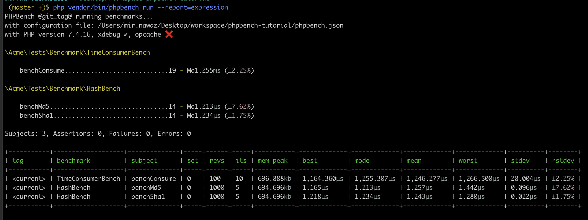

```shell
$ composer install
$ ./vendor/bin/phpbench run --report=default
$ ./vendor/bin/phpbench run --report=consumation_of_time
$ ./vendor/bin/phpbench run --report=expression
$ ./vendor/bin/phpbench run --report=expression --progress=histogram
$ ./vendor/bin/phpbench run --report=expression --progress=blinken
$ ./vendor/bin/phpbench run --report=expression --progress=blinken --retry-threshold=2
```

Store report with a tag and view
```shell
$ ./vendor/bin/phpbench run --report=expression --progress=blinken --tag=master
$ ./vendor/bin/phpbench report --ref=master --report=expression
```

Reference to a store report
```shell
$  ./vendor/bin/phpbench run --report=expression --progress=blinken --ref=master
```

System configs for the report 
```shell
$ ./vendor/bin/phpbench report --ref=master --report=env
```


Report
----------

